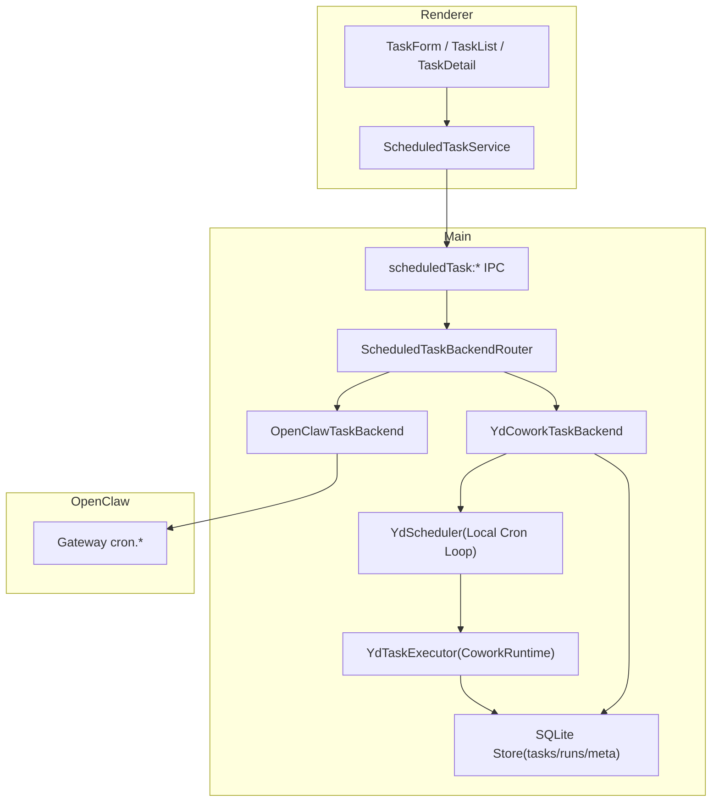

# LobsterAI 定时任务双后端方案（OpenClaw + yd_cowork）

## 1. 目标与约束

### 1.1 目标

本方案将现有“仅 OpenClaw 可用”的定时任务体系，升级为“双后端可切换”的架构：

1. `openclaw`：保留现有实现，继续调用网关 `cron.*` 接口。
2. `yd_cowork`：新增本地定时任务后端，基于 LobsterAI 主进程本地调度与 `yd_cowork` 任务执行闭环。

### 1.2 命名要求

- 方案内统一使用 `yd_cowork`。
- 不再使用 `yd_local` 命名。
- 配置项、UI 文案、日志标签、类型字面量都统一为 `yd_cowork`。

### 1.3 核心约束

1. 两套后端独立运行，不相互依赖。
2. 切换后端不影响现有会话主流程（Cowork/IM/Skills）。
3. `scheduledTask:*` IPC 契约保持稳定，Renderer 尽量无感。
4. `yd_cowork` 以“任务中心”运行，不强依赖 OpenClaw 的 agent/sessionKey 语义。

---

## 2. 现状问题

当前 `src/scheduledTask/cronJobService.ts` 完全绑定 OpenClaw 网关：

- CRUD/Run/Runs 全部转发 `cron.add/update/list/run/runs`。
- 轮询状态也依赖网关 `cron.list`。
- 主进程 `getCronJobService()` 在无 OpenClaw 适配器时不可用。
- `yd_cowork` 系统提示显式禁止定时任务。

结果：

1. 在 `agentEngine=yd_cowork` 下，定时任务 UI 存在但后端不可闭环。
2. 无法给 `yd_cowork` 提供真正的 `cron` 工具能力。
3. 定时任务能力与引擎耦合，难以做长期演进。

---

## 3. 目标架构

### 3.1 分层职责

1. **ScheduledTaskBackendRouter**：按配置选择后端。
2. **OpenClawTaskBackend**：封装现有 `CronJobService` 逻辑。
3. **YdCoworkTaskBackend**：本地任务 CRUD + 调度 + 执行 + 运行历史。
4. **YdScheduler**：本地触发器（`at/every/cron`），只负责触发，不执行业务。
5. **YdTaskExecutor**：把触发事件转成 `yd_cowork` 会话执行。

---

## 4. 配置设计（含命名统一）

## 4.1 新增配置项

建议新增：`scheduledTaskBackend`

可选值：

- `openclaw`
- `yd_cowork`
- `auto`

## 4.2 解析规则

1. 显式配置优先：`scheduledTaskBackend`。
2. `auto` 回退规则：
- 当 `agentEngine=openclaw` -> `openclaw`
- 当 `agentEngine=yd_cowork` -> `yd_cowork`

## 4.3 与现有配置关系

- `agentEngine` 继续用于对话引擎。
- `scheduledTaskBackend` 专门用于定时任务后端。
- 两者解耦，允许未来“主对话用 A，引擎调度用 B”的高级模式。

---

## 5. 数据模型设计（yd_cowork 后端）

目标：不依赖 OpenClaw 网关状态，全部本地可恢复。

## 5.1 表结构建议

1. `scheduled_tasks_v2`
- `id`
- `name`
- `description`
- `enabled`
- `backend` (`openclaw|yd_cowork`)
- `schedule_json`
- `payload_json`
- `binding_json`（`new_session/ui_session/im_session/session_key`）
- `delivery_json`
- `state_json`
- `created_at`
- `updated_at`

2. `scheduled_task_runs_v2`
- `id`
- `task_id`
- `backend`
- `session_id`
- `status` (`running/success/error/skipped`)
- `started_at`
- `finished_at`
- `duration_ms`
- `error`
- `summary`

3. 复用 `scheduled_task_meta`（origin/binding），按需升级字段。

## 5.2 命名空间策略

- `openclaw` 与 `yd_cowork` 的任务数据逻辑隔离。
- UI 默认展示“当前后端任务”；可扩展“全部后端”筛选。

---

## 6. 执行闭环（yd_cowork）

## 6.1 触发链路

1. `YdScheduler` 根据 `schedule` 计算到期任务。
2. 触发时先加“执行锁”（防重入）。
3. 创建 run 记录（`running`）。
4. 调用 `YdTaskExecutor` 执行。
5. 写回 run 结果与 task.state。
6. 广播 `scheduledTask:statusUpdate/runUpdate/refresh`。

## 6.2 会话策略（任务型）

1. `new_session`：每次触发创建新任务会话。
2. `ui_session`：绑定已有会话，连续追加执行。
3. `im_session`：绑定 IM 会话，执行后可走 IM 投递。
4. `session_key`：兼容预留，仅内部使用。

## 6.3 失败与重试

1. 单次任务（`at`）失败：记录失败，不重跑。
2. 周期任务（`every/cron`）失败：按退避策略延后下一次。
3. 进程重启恢复：启动后重建触发器并校正下一次执行时间。

---

## 7. `cron` 工具能力（yd_cowork）

## 7.1 工具接入目标

在 `CoworkRunner` host tools 中新增 `cron` 工具（仅 `yd_cowork` 生效）：

- `cron.add`
- `cron.list`
- `cron.update`
- `cron.remove`
- `cron.run`
- `cron.runs`

## 7.2 路由

工具调用不直连 OpenClaw，统一走 `ScheduledTaskBackendRouter`。

## 7.3 提示词策略

- `openclaw` 引擎：继续强调“使用 native cron”。
- `yd_cowork` 引擎：改为“使用本地 cron 工具（yd_cowork backend）”。
- 去掉“必须切换 OpenClaw”的硬阻断文案。

---

## 8. UI 与交互方案（参考截图）

## 8.1 计划时间组件

按照截图交互，统一以下计划类型：

1. 不重复（一次性）
2. 间隔（every）
3. 每小时
4. 每天
5. 每周
6. 每月

配套时间输入：`HH:mm`。

## 8.2 表单行为

1. 当类型为“不重复”：显示日期 + 时间。
2. 当类型为“间隔”：显示数值 + 单位（分钟/小时/天）。
3. 当类型为“每周”：显示周几选择。
4. 当类型为“每月”：显示日号选择。

## 8.3 后端选择 UI

在定时任务设置区新增“后端”选择：

- OpenClaw
- yd_cowork
- 自动

并展示说明：

- OpenClaw：依赖网关 `cron.*`
- yd_cowork：本地调度，本地执行

## 8.4 兼容策略

- 现有任务列表默认显示当前后端任务。
- 可增加“显示全部后端任务”开关（后续增强）。

---

## 9. IPC 与主进程改造

## 9.1 IPC 保持不变

保持已有 `scheduledTask:*` 调用面不变，内部改为 Router 分发：

- `list/get/create/update/delete/toggle/runManually/stop`
- `listRuns/countRuns/listAllRuns/resolveSession`
- `listChannels/listChannelConversations`

## 9.2 Router 分发规则

1. 从配置读取 `scheduledTaskBackend`。
2. 调用对应 backend 实例。
3. 异常统一包装成 IPC 错误结构。

---

## 10. 实施阶段（建议）

## Phase 0：文档与契约

1. 完成本方案文档。
2. 定义 `ScheduledTaskBackend` 接口与常量。
3. 将命名统一为 `yd_cowork`。

## Phase 1：Router + OpenClaw 适配

1. 提取现有 `CronJobService` 为 `OpenClawTaskBackend`。
2. 新增 `ScheduledTaskBackendRouter`。
3. 维持当前行为零回归。

## Phase 2：yd_cowork 本地后端闭环

1. 新建本地存储层（tasks/runs）。
2. 新建 `YdScheduler`（触发 + 恢复）。
3. 新建 `YdTaskExecutor`（调用 cowork runtime）。
4. 完成 run 历史、状态广播。

## Phase 3：cron 工具与提示词

1. `CoworkRunner` 注册 `cron` host tool。
2. `buildScheduledTaskEnginePrompt('yd_cowork')` 改为“可用本地 cron”。
3. IM 直建定时任务路径接入 Router。

## Phase 4：UI/配置升级

1. 按截图统一计划时间组件。
2. 增加后端选择与说明。
3. 增加后端筛选（可选）。

## Phase 5：迁移与灰度

1. 对已有 OpenClaw 任务维持原样。
2. 新建任务按后端配置落库。
3. 增加回退开关：一键切回 OpenClaw。

---

## 11. 验收标准

1. `agentEngine=yd_cowork` 时可完整创建/触发/查询/删除定时任务。
2. 应用重启后本地任务自动恢复，不丢执行计划。
3. UI 状态与 run 历史一致，无“假运行中”。
4. `openclaw` 路径无回归（历史任务可用、cron 轮询可用）。
5. IM 通道下可选投递路径仍可闭环。

---

## 12. 风险与对策

1. **并发重复触发**
- 对策：任务级互斥锁 + 运行中检查。

2. **重启时间漂移**
- 对策：启动时重算 `nextRunAtMs`，并做补偿触发窗口。

3. **双后端数据混淆**
- 对策：任务记录显式 `backend` 字段 + UI 筛选。

4. **执行超时拖垮队列**
- 对策：每次 run 设硬超时，超时后标记失败并释放锁。

---

## 13. 本方案落地时的命名约定（强制）

1. 后端枚举值使用：`openclaw | yd_cowork | auto`。
2. 任何代码、配置、文档不再出现 `yd_local`。
3. 日志标签推荐：
- `[ScheduledTaskRouter]`
- `[ScheduledTaskOpenClaw]`
- `[ScheduledTaskYdCowork]`
- `[YdScheduler]`
- `[YdTaskExecutor]`

---

## 14. 下一步建议

1. 先实现 Phase 1（Router 抽象）并保持行为不变。
2. 再实现 Phase 2（yd_cowork 本地闭环）作为可切换实验能力。
3. 最后做 Phase 4（UI/配置）并接入截图风格的计划时间交互。

